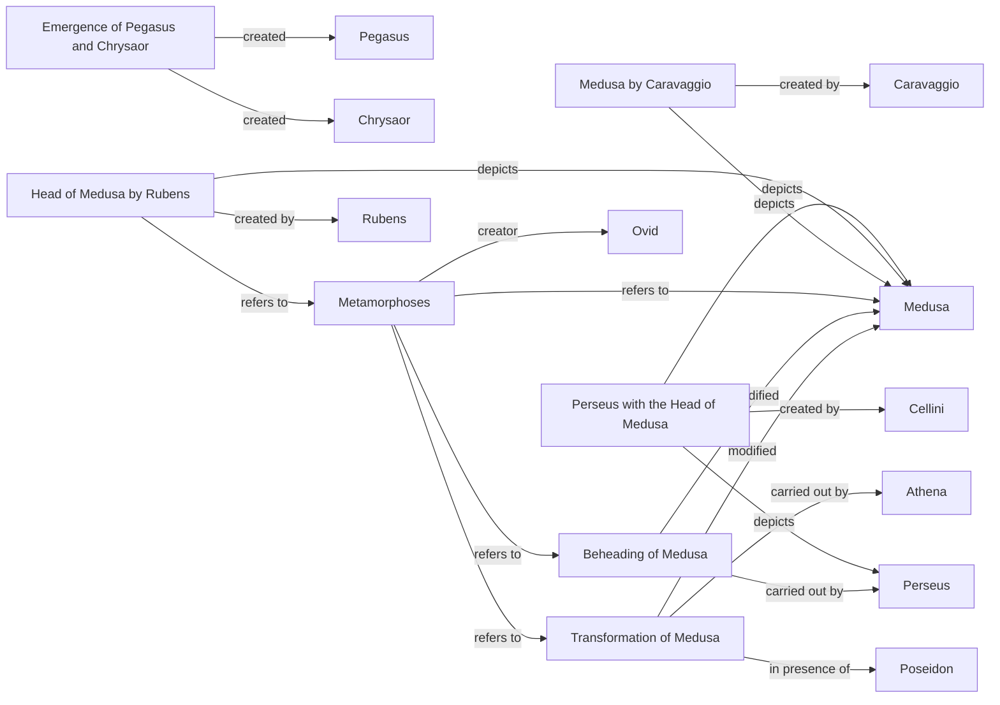

# Mermaid Knowledge Graph

```mermaid
graph LR
  Transformation[Transformation of Medusa] -->|modified| Medusa
  Transformation -->|carried out by| Athena
  Transformation -->|in presence of| Poseidon
  Beheading[Beheading of Medusa] -->|modified| Medusa
  Beheading -->|carried out by| Perseus
  Emergence[Emergence of Pegasus and Chrysaor] -->|created| Pegasus
  Emergence -->|created| Chrysaor
  Metamorphoses -->|creator| Ovid
  Metamorphoses -->|refers to| Medusa
  Metamorphoses -->|refers to| Transformation
  Metamorphoses -->|refers to| Beheading
  CaravaggioMedusa[Medusa by Caravaggio] -->|depicts| Medusa
  CaravaggioMedusa -->|created by| Caravaggio
  RubensMedusa[Head of Medusa by Rubens] -->|depicts| Medusa
  RubensMedusa -->|refers to| Metamorphoses
  RubensMedusa -->|created by| Rubens
  CelliniPerseus[Perseus with the Head of Medusa] -->|depicts| Medusa
  CelliniPerseus -->|depicts| Perseus
  CelliniPerseus -->|created by| Cellini
```
